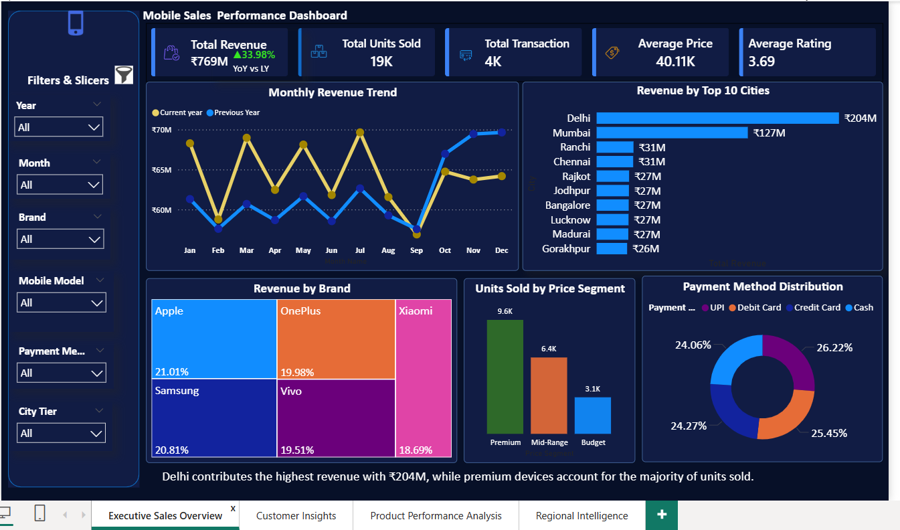
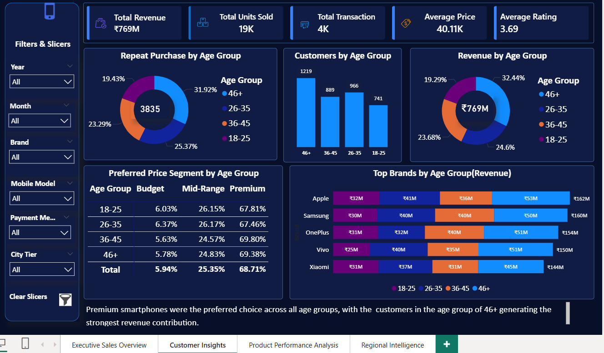
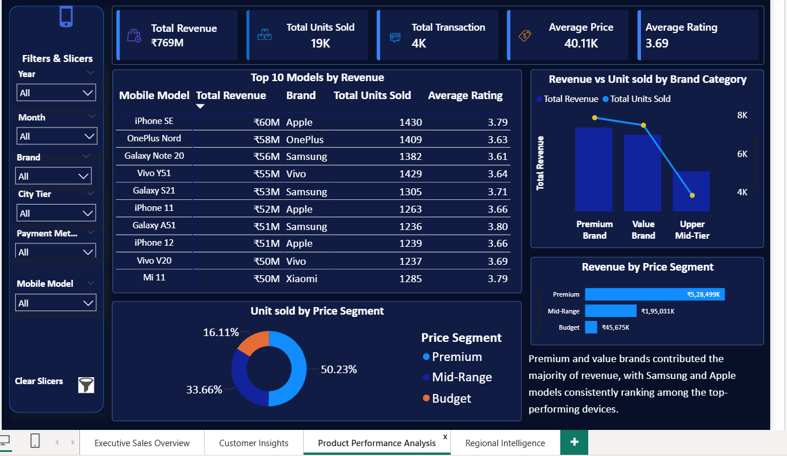
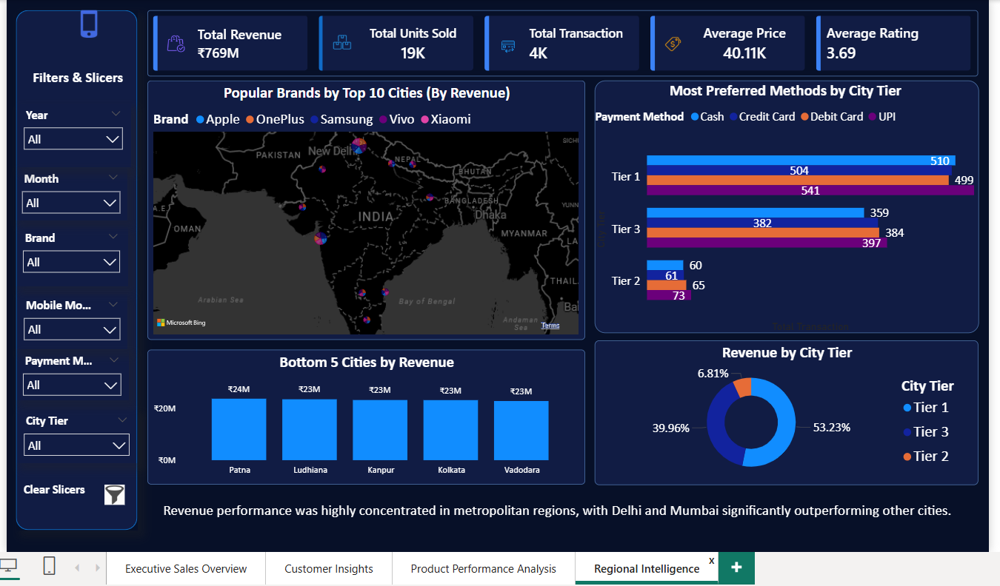

# 📱 Mobile Sales Data Analysis
This project analyzes mobile sales data and generate actionable business insights from transactional records.

---

## 📌 Table of Contents
- [📌 Overview](#-overview)
- [📌 Problem Statement](#-problem-statement)
- [📌 Project Objective](#-project-objective)
- [📂 Dataset Information](#-dataset-information)
- [📌 Data Preparation & Modeling](#-data-preparation--modeling)
- [🛠️ Tech Stack](#️-tech-stack)
- [📊 Dashboards & Key Insights](#-dashboards--key-insights)
  - [1. Executive Sales Overview Dashboard](#1-executive-sales-overview-dashboard)
  - [2. Customer Insights Dashboard](#2-customer-insights-dashboard)
  - [3. Product Performance Dashboard](#3-product-performance-dashboard)
  - [4. Regional Intelligence Dashboard](#4-regional-intelligence-dashboard)
- [📌 Recommendations](#-recommendations)
- [💡 Business Impact](#-business-impact)
- [🚀 How to Run This Project](#-how-to-run-this-project)
---

## 📌 Overview  
This project analyzes mobile sales transaction data to understand customer behavior, product demand, pricing patterns, and regional performance.  

Using **Power BI**, raw transactional data was transformed into an interactive reporting solution that provides a clear view of business performance through KPIs, trends, and visual analysis.  

The dashboard suite helps uncover meaningful patterns and supports data-driven decision-making through intuitive visual storytelling.

---

## 📌 Problem Statement  
The business was generating large volumes of sales data across multiple brands, cities, customer groups, and payment methods. However, the data was scattered and difficult to analyze efficiently.  

As a result, management lacked clear visibility into:
- Sales performance trends  
- Customer preferences  
- Regional performance  
- Underperforming areas  

This made timely and effective decision-making challenging.

---

## 📌 Project Objective  
The objective of this project was to build an interactive analytical solution that transforms raw sales data into actionable insights.

Key goals:
- Monitor overall sales performance through KPIs  
- Analyze customer purchasing behavior and product demand  
- Identify top-performing brands, cities, and segments  
- Track monthly and regional trends  
- Enable data-driven decision-making  

---

## 📂 Dataset Information  
The dataset contains approximately **3,800 mobile sales transactions from 2021-2024**, imported from Excel.

### Key Fields:
- Transaction ID  
- Date (Day, Month, Year, Day Name)  
- Mobile Brand & Model  
- Units Sold  
- Price Per Unit  
- Customer Name & Age  
- City  
- Payment Method  
- Customer Ratings  

---

## 📌 Data Preparation & Modeling  
- Standardized column names, formats, and data types  
- Created dimension tables: `Dim_Product`, `Dim_Customer`, `Dim_Payment`, `Dim_Calendar`  from `Fact_Sales`
- Built a dynamic **Dim_Calendar** using Power Query (M language)  
- Designed a **Star Schema data model** in Power BI  
- Created calculated columns and DAX measures for KPIs and segmentation  
- Enabled time intelligence and trend analysis  

---

## 🛠️ Tech Stack  
- Power BI Desktop – Dashboard development & visualization  
- Power Query – Data cleaning & transformation  
- DAX – KPI calculations & measures  
- Data Modeling – Star schema design  
- Microsoft Excel – Data source  
- Git & GitHub – Version control & project publishing  

---

## 📊 Dashboards & Key Insights  
---
### 1. Executive Sales Overview Dashboard  

**Purpose:** High-level business performance tracking  

**Key KPIs:**
- 💰 Total Revenue: ₹769M (33.98% YoY growth)  
- 📱 Units Sold: 19K  
- 🧾 Transactions: 4K  
- 💵 Average Price: ₹40.11K  
- ⭐ Average Rating: 3.69  

**Insights:**
- Strong revenue growth driven by premium segment  
- Festive season significantly boosts sales  
- Digital payments dominate transactions  

---

### 2. Customer Insights Dashboard  

**Purpose:** Understand customer behavior and demographics  

**Key Insights:**
- 🔁 Customers aged **46+** show highest repeat purchases  
- 👤 Largest customer base: **26–35 & 46+ age groups**  
- 💰 Highest revenue: **46+ age group**  
- 📦 Premium smartphones preferred across all age groups  
- 📱 Apple & Samsung dominate across demographics  

---

### 3. Product Performance Dashboard  

**Purpose:** Analyze product demand and performance  

**Key Insights:**
- 📱 Top models: iPhone SE, OnePlus Nord  
- 💰 Premium segment generates highest revenue  
- 📦 Strong shift toward high-value smartphone purchases  
- 📊 Premium devices dominate overall market share  

---

### 4. Regional Intelligence Dashboard  

**Purpose:** Analyze geographical sales distribution  

**Key Insights:**
- 🏙️ Delhi & Mumbai are top revenue cities  
- 💳 UPI & cards dominate payment methods  
- 📉 Patna & Ludhiana are underperforming cities  
- 🏙️ Tier 1 cities contribute **53%+ revenue** 

- 📉 Despite strong performance in 2021 and 2022, and overall strong results across the analysis period, there is a decline in sales November 2022 onwards. This drop suggests potential market saturation or shifting customer behavior, requiring deeper investigation into product and regional trends.
---

## 📌 Recommendations  
Focus on expanding premium smartphone offerings and strengthening marketing in Tier 1 cities.  
Increase targeted campaigns in Tier 2 and Tier 3 cities to unlock untapped growth potential.  
Improve customer satisfaction strategies to increase ratings and long-term loyalty. The decine in sales performance in  the years 2023- 2024 needs to be investigated.

---

## 💡 Business Impact  
This project enables data-driven decision-making by providing clear visibility into:
- Sales performance  
- Customer behavior  
- Product demand  
- Regional trends  

It helps businesses:
- Identify high-revenue segments  
- Optimize pricing and inventory strategies  
- Improve marketing targeting  
- Increase overall revenue growth  
- Enhance customer retention and satisfaction 

---

## 🚀 How to Run This Project

- Download the project files from GitHub.

- Open the folder containing the project files.

- Locate the `.pbix` Power BI dashboard file.

- Open it using Power BI Desktop.

- Go to **Home → Transform Data → Data Source Settings**
- Click on **Change Source** and browse to the project data folder (Excel)
- Select **Close & Apply**
- Click **Refresh** to load all visuals properly

---

## 👤 Author  
**Sapna Devi**  
📧 sapnadevi9991@gmail.com